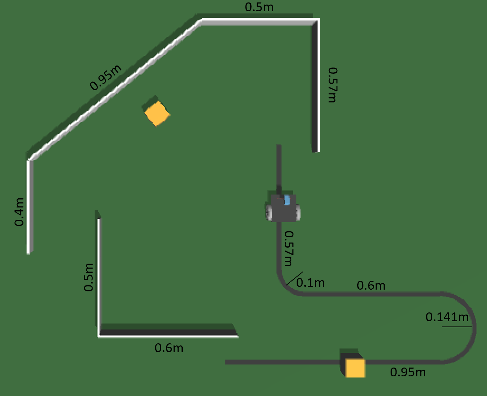

# Synthetic Dataset for Mobile Robots Localization Algorithms (SyMoLo)

Synthetic dataset generated by realistic simulation of a differential mobile robot, including data such as robot position and orientation (ground truth), sensors readings, velocities, and RGB camera images for development and evaluation of classical and emerging localization algorithms.

## Description

This dataset is intended for use in training, testing, and development of localization algorithms for differential mobile robots. The synthetic dataset was generated through realistic simulation performed inside SimTwo, a physics-based open-source simulator. Realistic models of sensors and actuators were inserted inside the simulator environment and the data were generated by applying the Hardware-in-the-loop approach. The microcontroller applied for the processing was an Arduino Mega. A virtual differential mobile robot was used for dataset generation. The robot was equipped with sensors and actuators to perform tasks such as line-following, wall-following, and obstacle avoidance. 

## Structure

The structure of the dataset is organized in folders and files as illustrated in the diagram below. There are two folders destined for the two paths, one in the clockwise direction and the other in the counterclockwise direction. Within each trajectory folder, there are 3 more folders dedicated to each of the 3 tests carried out on the same route. Inside each test folder, there is a *data.csv* file containing data collected from the sensors, robot position and orientation (ground truth), velocities, operational states and associated images. The jpg images captured are presented in the folder *images*. There is also an *image_positions.txt* file that includes the position of the robot for each captured image. The SyMoLo dataset also includes this *README.md* file with a detailed description of the dataset and a *metadata.json* file containing metadata information, relevant for reproducibility.

```text
Dataset/
├── trajectory_clockwise/
│   ├── test1_CW/
│   │   ├── data.csv
│   │   ├── image_positions.txt
│   │   └── images/
│   │       ├── 1.jpg
│   │       └── 2.jpg
│   ├── test2_CW/
│   └── test3_CW/
├── trajectory_counterclockwise/
│   ├── test1_CCW/
│   ├── test2_CCW/
│   └── test3_CCW/
├── README.md
└── metadata.json
```

## Types and Format of Data

The SyMoLo dataset collected several types of data, presented in the table below, that represent the state and the perception of the robot through the simulated trajectories. The quantitative data were captured at a sampling frequency of 20Hz, resulting in a timestamp interval of approximately 50ms between samples. These data include the readings from the three Time-of-Flight (ToF) distance sensors that provide distance measurements from obstacles around the robot. Readings from the line sensor QTR-8A, which is composed by 8 phototransistors, allowing to identify the relative position of the robot in relation to the black line on the floor. 

Other data are also included, such as the absolute position and orientation of the robot (ground truth) in the simulated environment, operational states, and linear and angular velocities of the robot during the path. The robot has four main states: 0 for line following, 1 for right wall following, 2 for left wall following, and other for obstacle avoidance, being the last one divided in 5 and 6 by left and right side respectively. Then, there are other states related to specific movements, such as turn right, turn left and get lost.

Besides that, the dataset also includes images captured by a virtual frontal camera at a sampling frequency of 5Hz (timestamp of 200ms). For each generated image, the corresponding robot coordinates are also provided in the simulated world, allowing direct associations between visual perception and localization. These data are temporally synchronized, enabling combined analysis and application in machine learning tasks.     

| **Data** | **Unit/Format** | **Description** |
|---------|-----------------|-----------------|
| t | milliseconds | Timestamp at each data sample, since the start of the experiment. <br> Obs: sampling frequency of 20Hz (50ms). |
| x | meters | Robot's position along the X-axis in global reference. |
| y | meters | Robot's position along the Y-axis in global reference. |
| theta | rad/s | Orientation of the robot. |
| state | n/a | Current operational mode of the robot, such as line following, wall following, obstacle avoidance, and others. |
| v | m/s | Linear velocity of the robot. |
| w | rad/s | Angular velocity of the robot. |
| d_f | meters | Distance measured by the front ToF sensor. |
| d_l | meters | Distance measured by the left ToF sensor. |
| d_r | meters | Distance measured by the right ToF sensor. |
| L0...L7 | n/a | Readings obtained from QTR-8A line sensor, composed by an array of 8 reflective phototransistors. |
| img | jpg | Image number assigned at this sample. <br> Obs: if the number is 0, there isn't an image assigned to this sample. The sampling frequency was 5Hz (200ms). |

### Scenario Layout

The scenario applied for the collection of this synthetic dataset was created inside the [SimTwo simulator](https://github.com/P33a/SimTwo). The scenario was based on the differential mobile robot tasks, such as line-following, wall-following, and obstacle avoidance. Therefore, the scenario includes walls in different positions, a black line with different curvatures, and obstacles along the way. The dimensions of the scenario, including the walls and the track are specified, in meters, in the figure below . Both yellow obstacles had a dimension of 0.08x0.08x0.12m and the height of all the walls was 0.15m.



### Robot Description

The virtual mobile robot features two DC motors 6V for locomotion. For environmental perception was applied three Time-of-Flight (ToF) distance sensors (front, left, right) and an array of 8 reflective phototransistors (QTR-8A) used as a line sensor. One of the distance sensors was positioned in front of the robot, and the other two were on the sides, one on the right side and the other on the left side, maintaining a 45-degree angle from the center of the robot. A virtual RGB camera is mounted on the front part of the robot chassis in order to have visual information. The camera was positioned at 0.07m of height from the robot base and 60◦ of inclination in relation to the axis perpendicular to the ground.  

The robot has the following main specifications:

- **Type**: Differential (two independent DC motors)
- **Virtual camera**: RGB, focal length 30 meters 
- **Distance sensors**: 3 × Time-of-Flight (ToF) sensors, beam length: 0.3m, including error and noise modeled from real sensor
- **Motors**: 2 x 6V DC motors, including constants modeled from real motor
- **Line sensor**: QTR-8A, returning 8 raw readings (L0...L7)
- **Kinematics**: Realistic dynamic model including inertia, wheel radius, and friction
- **Robot dimensions**: Length: 0.12m, width: 0.11m, height: 0.05m, thickness: 0.003m, mass:3
- **Wheels dimensions**: WheelDiameter:0.069m, wheelThickness:0.011, wheelClearance: 0.001, wheelMass:0.15              

All sensor data and motor signals were simulated in the SimTwo environment, with realistic physical modeling and noise to approximate real-world conditions.

## Simulation Details

For the dataset collection, it was applied the Hardware-in-the-loop (HIL) approach. The description of this method can be found in this [scientific paper](https://ieeexplore.ieee.org/document/10708336). Therefore, the data obtained are the result of processing on real hardware, in this case an Arduino Mega. However, the reading of sensors and the actuation of the robot are fully simulated. 

## Dataset Usage

The synthetic dataset, developed using a virtual robot and a realistic simulation, integrates quantitative data with visual information, providing a rich and structured source for training and validating classical and emerging algorithms of mobile robots localization. In particular, recent machine learning (ML) approaches can benefit from this dataset, as ML techniques are increasingly applied to enhance robot localization by improving accuracy, robustness, and adaptability in complex and dynamic environments.

The dataset also facilitates reproducibility and benchmarking, while reducing costs and complexity associated with real-world data collection. By simulating realistic scenarios with controlled variables, this dataset enables the testing of perception and control strategies in a reproducible and scalable way, making it particularly valuable for benchmarking performance under diverse conditions without the limitations imposed by physical hardware. 

## License

The SyMoLo dataset  is open-source.

## Citation

If you use this dataset, please cite:  

[1]Laiany Suganuma, «Laiany/SyMoLo-dataset: SyMoLo dataset». Zenodo, Jun. 30, 2025. doi: 10.5281/zenodo.15775083.

## Requisities

For the reproducibility of this dataset, it is necessary to install the [SimTwo simulator](https://github.com/P33a/SimTwo).
In addition, to generate data using the Hardware-in-the-loop technique, a microcontroller, such as Arduino Mega or other, is required to be connected to the computer.

